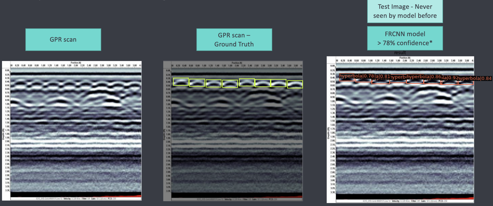

# Detecting Objects in Ground Penetrating Radars Scans

We used mmdetection library for fine-tuining Faster RCNN, Mask RCNN, and YOLO to 
identify objects from Ground penetrating radar scans.

### Data: 
- Used publicaly available dataset containing 171 annotated 
GPR scans from https://github.com/irenexychen/gpr-data-classifier.
- Converted the annotations from .xml format to .coco format using 
https://github.com/yukkyo/voc2coco.
### Creating fake data using GANS: 
- Code: GPR_GAN_071521_v.0.4.ipynb
#### GANs architecture(created from scratch):
- Generator: 
  - Input: A tensor of size (100, 1, 1) filled with random numbers from a normal distribution(mean = 0, variance = 1)
  - Output: A tensor of size (3, 128 , 128) representing Image
  - NN Architecture: 6 transpose convolutions with batch normalization and ReLU activations. 
- Discriminator:
  - Input: (3, 128, 128) size tensor either real or fake
  - Output: Classification of input as either real(1) or fake(0)
  7 Conv layers with batch normalization and ReLU
- Loss: Binary Cross Entropy Loss

#### GANs results:

### Hyperbola detection:
- Code: GPR_MMDetection_v0.022.ipynb
- We finetuned multiple object detection models with various checkpoints and due to the scarsity of GPR scans, 
the FRCNN model pretrained on MS-COCO dataset with resnet-101
as backbone gave the best results.

### Results: 
- We finetuned FRCNN with both real images and fake images from GANs
- Achieved mAP 0.90 in detecting hyperbolas 

